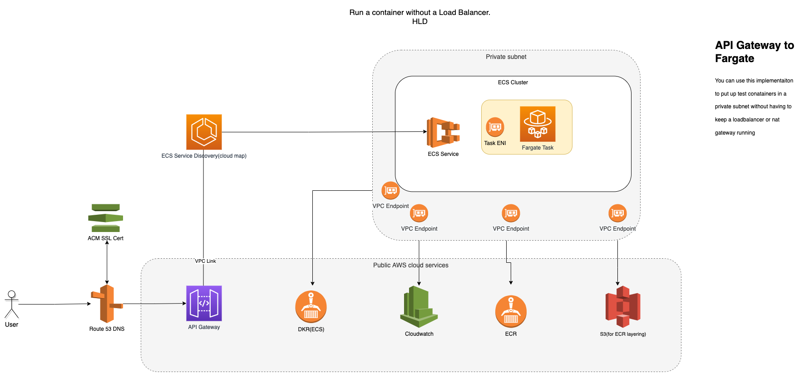

## API Gateway to ECS Fargate
You can use this implementaiton to put up docker api based container into a private subnet without having to keep a loadbalancer or nat gateway running and incurring costs. This architecture uses purely serverless components and is meant to do POC's but can be scaled with loadbalancers and monitoring agents.
This sets up an isolated container which has no public route to the internet and instead uses AWS network(vpc endpoints) to contact other AWS service/apis.
The Docker image envisaged for this has 3 api routes but you should change API Gateway recource mapping for your specific needs.

## Architecture

## Input arguments
* Existing domain name registered in route53 eg "mywebsite.com"
* Subdomain you want create on your domain name for api gateway to setup eg "sidecar"
* SSL certificate ARN
* VPC ID with at least 2 private subnets and DNS hostnames and DNS Resolution activated. 
* Docker container/task command arguments ie port mapping. This needs to be in the form of a list eg ["-listen", "tcp://:5000"].

## Prerequisites
The following are required to deploy this Terraform module

1. Valid SSL certificate ARN matching on the domain name alias which you intend to use ie "sidecar.mywebsite.com".
1. Docker image locally to push to newly created ECS. This containers serves 3 api endpoints(metrics, health and metrics/health), you should change your terraform intergrations to match your own container requirements
1. VPC with at least 2 private subnets and DNS hostnames and DNS Resolution activated.
1. Existing domain name registered in route53 eg "mywebsite.com"
1. Terraform must be bootstrapped. This means that a state S3 bucket and a state locking DynamoDB table must be initialized.

##  Post Launch commands to push local docker image to ECR repo
* Give ECR login credentials for docker
aws ecr get-login-password --region eu-west-2 | docker login --username AWS --password-stdin ACCOUNTID.dkr.ecr.eu-west-2.amazonaws.com
* Tag local docker image
docker tag LOCAL_DOCKERIMAGE:latest ACCOUNTID.dkr.ecr.REGION.amazonaws.com/REPONAME:latest
* Push to newly created ECR repo. Value is outputed
docker push ACCOUNTID.dkr.ecr.REGION.amazonaws.com/REPONAME:latest 

##  Rescources created
* API Gateway HTTP protocol. With 3 intergrations routes, Metrics, Health and metrics/prometheus
* Custom Domain name for API gateway
* VPC Link for API
* Service discovery for ECS
* ECR Repo
* ECS Cluster
* VPC Endpoints
* IAM Policies and roles
* Fargate Task Definition
* Route 53 record with alias to API Gateway VPClink
* Security groups

## Module Variables

| Variable  | Description | Type | Default | Required |
| ---      |  ------  |----------|----------|----------|
| `domain_name` | Existing domain record already setup in route53 | `string` | na  | `Yes`|
| `route53_subdomain` | subdomain name which API gateway will use for custom domain setup. Needs to match the ACM SSL | `string` | na  | `Yes`|
| `domain_name_certificate_arn` | The ACM certificate ARN to use for the api gateway | `string` | na  | `Yes`|
| `region` | AWS region to deploy resources | `string` | `eu-west-2`  | `Yes`|
| `name_prefix` | name prefix to give to all recources in project | `string` | `sidecar`  | `Yes`|
| `command_args` | docker container command arguments | `string` | na  | `Yes`|
| `controller_port` | port number for container to publish  | `integer` | `5000`  | `Yes`|
| `controller_cpu` | The amount of CPU to dedicate to the fargate task. This must be one of the accepted Fargate [options](https://docs.aws.amazon.com/AmazonECS/latest/developerguide/task-cpu-memory-error.html).| `number` | `2048` | `Yes`|
| `controller_memory` | The amount of memory to dedicate to the fargate task. This must be one of the accepted Fargate [options](https://docs.aws.amazon.com/AmazonECS/latest/developerguide/task-cpu-memory-error.html).| `number` | `4096` | `Yes`|
| `default_tags` | A mapping set of tags available to set on resources | `map(string)` | `Terraform = "true"  | `Yes`|
